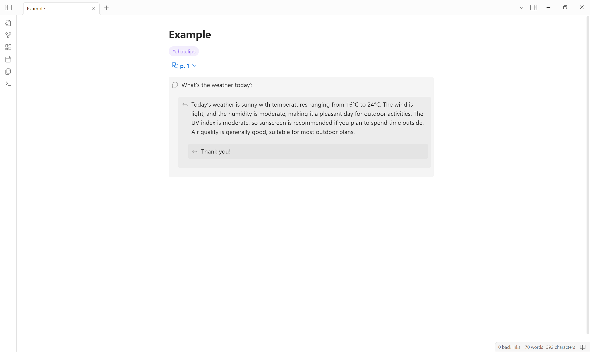

<!--
 * @Author       sleepingraven
 * @Date         2024-12-30 17:05:32
 * @LastEditors  sleepingraven
 * @LastEditTime 2025-02-15 12:46:10
 * @FilePath     \chat-clips\README.md
 * @Description  这是默认设置,请设置`customMade`, 打开koroFileHeader查看配置 进行设置: https://github.com/OBKoro1/koro1FileHeader/wiki/%E9%85%8D%E7%BD%AE
-->
# Chat Clips

This plugin allows record chat in markdown list in *editing view*, and display comments-like layout in *reading view*.

## Example

### Editing view

``` markdown
1. #chatclips
2. p 1
    - What's the weather today?
        - Today's weather is sunny with a high temperature of 9°C and a low temperature of -2°C. The wind is from the northwest at level 3, and the relative humidity is 22%. The UV index is strong, and the air quality is moderate with an AQI of 54.
            - Thank you!
```

### Reading view



## Usage

### Define a chat clips list

A *chat clips list* is defined by:

1. An ordered list at first level.
   - First list item is to indicate chat clips.
   - Followed list items are recognized as [*chat clips commands*](#chat-clips-commands).
2. Unordered lists that start at the second level.
   - Each unordered list item is rendered to a *chat clips comment* in reading view.

### Chat clips commands

| Name   | Description                 | Pattern                              |
| ------ | --------------------------- | ------------------------------------ |
| Group  | Fold sublists into a group. | `<group-title>` \| `"<group-title>"` |
| Page   | Fold sublists into a page.  | `p <page-number>`                    |

### Customize appearance

You can use [CSS snippets](https://help.obsidian.md/snippets) to customize the appearance.

Example:

``` css
.callout[data-callout^="chat-clips-folder"] {
  background-color: transparent;
}
.callout[data-callout^="chat-clips-comment"] {
  --callout-color: var(--callout-quote);
}
```

Applicable CSS selectors are as follows:

``` css
/* fuzzyly select */
.callout[data-callout^="chat-clips-folder"],
.callout[data-callout^="chat-clips-comment"] {
}

/* precisely select */
.callout[data-callout="chat-clips-folder-group"],
.callout[data-callout="chat-clips-folder-page"],
.callout[data-callout="chat-clips-comment-1"],
.callout[data-callout="chat-clips-comment-2"]/*,
.callout[data-callout="chat-clips-comment-3"],
…… */ {
}
```

## Limitation

1. Chat clips comment can not contain unordered list.
2. Chat clips comment can not apply indents.

## Installation

### [Install from community plugins](https://help.obsidian.md/Extending+Obsidian/Community+plugins#Install+a+community+plugin)

### Install manually

1. Open [latest release](https://github.com/sleepingraven/obsidian-chat-clips/releases/latest).
2. Download `main.js`, `manifest.json` and `styles.css` to `<obsidian-vault>/.obsidian/plugins/chat-clips`.
